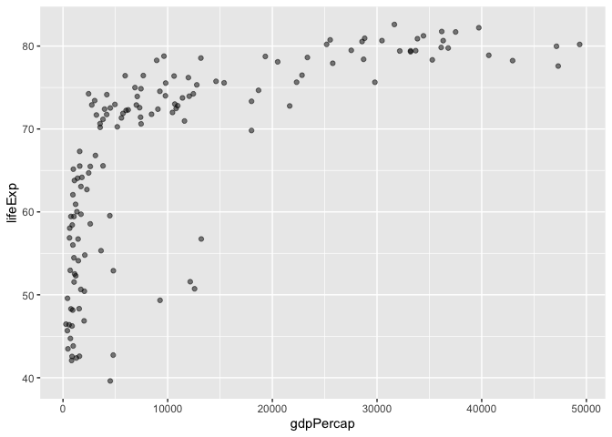
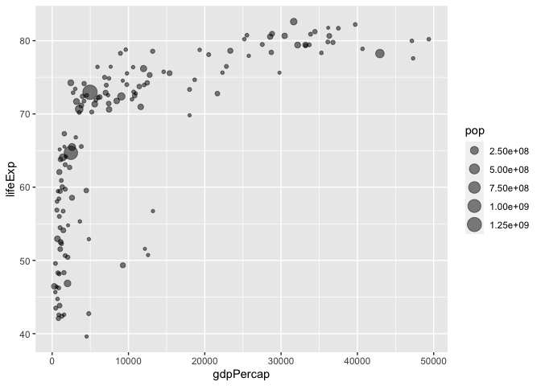
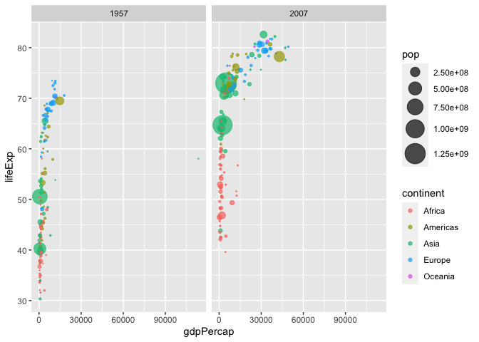

Class 05: Data Visualization with GGPLOT
================
Audrey Nguyen

# Plotting in R

R has multiple plotting and graphics systems. The most popular of which
is **ggplot**.

We have already played with “base” R graphics. This comes along with R
“out of the box”.

``` r
plot(cars)
```


Compared to base R plots, ggplot is much more verbose - I need to write
more code to get simple plots like the above.

To use gg plot, I need to first install the ggplot2 package. To install
any package in R, I use the `install.packages()` command along with the
package name.

The install is a one time only requirement. The package is now on our
computer. I don’t need to reinstall it.

However, I can’t just use it without loading it up with a `library()`
call.

``` r
library(ggplot2)
```

``` r
ggplot(cars)
```


All ggplot figures need at least 3 things:

- data (this is the data.frame with our numbers)
- aesthetics (“aes”, how our data maps to the plot)
- geoms (do you want lines, points, columns, etc…)

``` r
ggplot(data=cars) + 
  aes(x=speed, y=dist) + geom_point()
```


I want a trend line to show correlation between speed and stopping
distance.

``` r
ggplot(data=cars) + 
  aes(x=speed, y=dist) + geom_point() + geom_line()
```


That is not what we want.

``` r
bb <- ggplot(data=cars) + 
  aes(x=speed, y=dist) + geom_point()     

bb
```


``` r
bb + geom_smooth(method = "lm", se=FALSE)
```

    `geom_smooth()` using formula = 'y ~ x'


``` r
url <- "https://bioboot.github.io/bimm143_S20/class-material/up_down_expression.txt"
genes <- read.delim(url)
head(genes)
```

            Gene Condition1 Condition2      State
    1      A4GNT -3.6808610 -3.4401355 unchanging
    2       AAAS  4.5479580  4.3864126 unchanging
    3      AASDH  3.7190695  3.4787276 unchanging
    4       AATF  5.0784720  5.0151916 unchanging
    5       AATK  0.4711421  0.5598642 unchanging
    6 AB015752.4 -3.6808610 -3.5921390 unchanging

``` r
ggplot(genes) + aes(x=Condition1, y=Condition2) + geom_point()
```


``` r
p <- ggplot(genes) + 
    aes(x=Condition1, y=Condition2, col=State) +
    geom_point()
p
```


``` r
p + scale_colour_manual( values=c("blue","gray","red") )
```


``` r
p + scale_colour_manual(values=c("blue","gray","red")) +
    labs(title="Gene Expresion Changes Upon Drug Treatment",
         x="Control (no drug) ",
         y="Drug Treatment")
```


The **gapminder** dataset contains economic and demographic data about
various countries since 1952.

``` r
# File location online
url <- "https://raw.githubusercontent.com/jennybc/gapminder/master/inst/extdata/gapminder.tsv"

gapminder <- read.delim(url)
```

Using some **dplyr** code to focus in on a single year. You can install
the **dplyr** package with the command `install.packages("dpylr")`.

``` r
# install.packages("dplyr")  ## un-comment to install if needed
library(dplyr)
```


    Attaching package: 'dplyr'

    The following objects are masked from 'package:stats':

        filter, lag

    The following objects are masked from 'package:base':

        intersect, setdiff, setequal, union

``` r
gapminder_2007 <- gapminder %>% filter(year==2007)
```

The `gapminder_2007` dataset contains the variables GDP per capita
`gdpPercap` and life expectancy `lifeExp` for 142 countries in the year
2007.

``` r
ggplot(gapminder_2007) +
  aes(x=gdpPercap, y=lifeExp) +
  geom_point()
```


Specifying alpha in the geom_point will make the points slightly
transparent.

``` r
ggplot(gapminder_2007) +
  aes(x=gdpPercap, y=lifeExp) +
  geom_point(alpha=0.5)
```



Mapping the `continent` variable to the point color aesthetic and the
population `pop` (in millions) through the point `size` argument

``` r
ggplot(gapminder_2007) +
  aes(x=gdpPercap, y=lifeExp, color=continent, size=pop) +
  geom_point(alpha=0.5)
```


Seeing how the plot looks like if we color the points by the numeric
variable population `pop`:

``` r
ggplot(gapminder_2007) + 
  aes(x = gdpPercap, y = lifeExp, color = pop) +
  geom_point(alpha=0.8)
```


We can plot the GDP per capita (`x=gdpPercap`) vs. the life expectancy
(`y=lifeExp`) and set the point `size` based on the population
(`size=pop`) of each country we can use.

``` r
ggplot(gapminder_2007) + 
  aes(x = gdpPercap, y = lifeExp, size = pop) +
  geom_point(alpha=0.5)
```



Point sizes in the plot don’t clearly reflect the population differences
in each country. The 250 million people point and the 750 people point
sizes aren’t proportional. To reflect the actual population differences
by the point size, use the `scale_size_area()` function.

``` r
ggplot(gapminder_2007) + 
  geom_point(aes(x = gdpPercap, y = lifeExp,
                 size = pop), alpha=0.5) + 
  scale_size_area(max_size = 10)
```


Reproduce the gapminder scatter plot for the year 1957.

``` r
gapminder_1957 <- gapminder %>% filter(year==1957)

ggplot(gapminder_1957) + 
  aes(x = gdpPercap, y = lifeExp, color=continent, size = pop) + 
  geom_point(alpha=0.7) + 
  scale_size_area(max_size = 10)
```


Include 1957 and 2007 in the input data set for `ggplot()`. Include the
layer `facet_wrap(~year)` to produce the following plot.

``` r
gapminder_1957 <- gapminder %>% filter(year==1957 | year==2007)

ggplot(gapminder_1957) + 
  geom_point(aes(x = gdpPercap, y = lifeExp, color=continent,
                 size = pop), alpha=0.7) + 
  scale_size_area(max_size = 10) +
  facet_wrap(~year)
```


