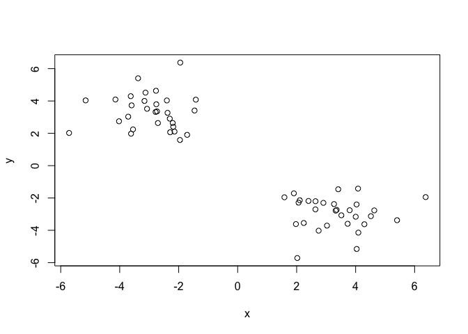
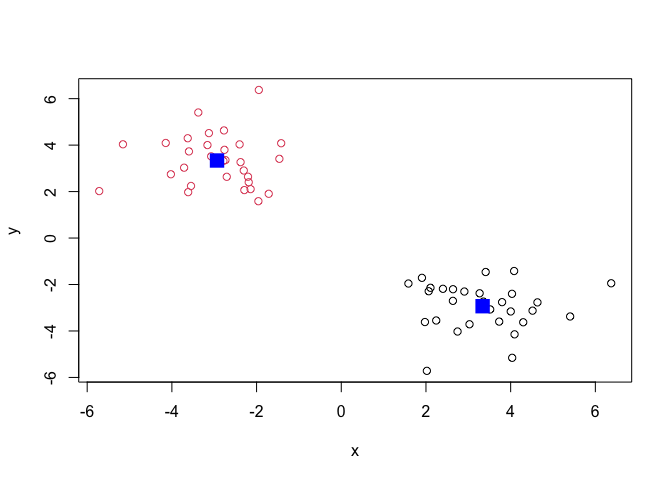
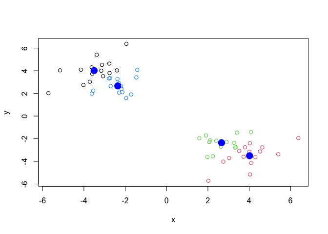
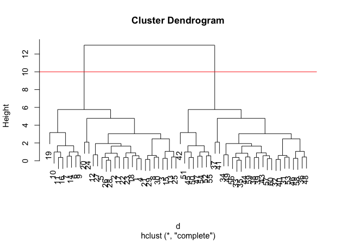
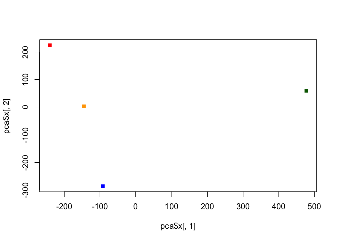

Class 7: Machine Learning I
================
Audrey Nguyen

In this class we will explore clustering and dimensionality reduction
methods.

\##K-means

Make up some input data where we know what the answer should be.

``` r
tmp <- c(rnorm(30, -3), rnorm(30, +3))
x <- cbind(x=tmp, y=rev(tmp))
x
```

                  x         y
     [1,] -2.202307  2.638781
     [2,] -2.758632  3.797427
     [3,] -3.615402  1.975834
     [4,] -2.185439  2.400683
     [5,] -3.072495  3.516463
     [6,] -4.144754  4.092026
     [7,] -3.160108  4.002109
     [8,] -1.957332  1.585524
     [9,] -3.625541  4.296611
    [10,] -3.376251  5.404691
    [11,] -3.125352  4.517135
    [12,] -1.419258  4.081445
    [13,] -3.711515  3.028316
    [14,] -3.596732  3.729191
    [15,] -3.548329  2.242038
    [16,] -2.769599  4.632444
    [17,] -2.401037  4.031739
    [18,] -2.704115  2.636262
    [19,] -1.946622  6.374253
    [20,] -5.716281  2.021432
    [21,] -2.289080  2.064919
    [22,] -2.377910  3.266877
    [23,] -2.302208  2.906966
    [24,] -5.155344  4.035769
    [25,] -4.023316  2.745723
    [26,] -2.735511  3.355869
    [27,] -1.461885  3.410039
    [28,] -2.783350  3.322758
    [29,] -2.141027  2.106018
    [30,] -1.713178  1.905253
    [31,]  1.905253 -1.713178
    [32,]  2.106018 -2.141027
    [33,]  3.322758 -2.783350
    [34,]  3.410039 -1.461885
    [35,]  3.355869 -2.735511
    [36,]  2.745723 -4.023316
    [37,]  4.035769 -5.155344
    [38,]  2.906966 -2.302208
    [39,]  3.266877 -2.377910
    [40,]  2.064919 -2.289080
    [41,]  2.021432 -5.716281
    [42,]  6.374253 -1.946622
    [43,]  2.636262 -2.704115
    [44,]  4.031739 -2.401037
    [45,]  4.632444 -2.769599
    [46,]  2.242038 -3.548329
    [47,]  3.729191 -3.596732
    [48,]  3.028316 -3.711515
    [49,]  4.081445 -1.419258
    [50,]  4.517135 -3.125352
    [51,]  5.404691 -3.376251
    [52,]  4.296611 -3.625541
    [53,]  1.585524 -1.957332
    [54,]  4.002109 -3.160108
    [55,]  4.092026 -4.144754
    [56,]  3.516463 -3.072495
    [57,]  2.400683 -2.185439
    [58,]  1.975834 -3.615402
    [59,]  3.797427 -2.758632
    [60,]  2.638781 -2.202307

``` r
head(x)
```

                 x        y
    [1,] -2.202307 2.638781
    [2,] -2.758632 3.797427
    [3,] -3.615402 1.975834
    [4,] -2.185439 2.400683
    [5,] -3.072495 3.516463
    [6,] -4.144754 4.092026

Quick plot of x to see the two graphs at -3, 3 and +3, -3

``` r
plot(x)
```



Use the `kmeans()` function setting k to 2 and nstart = 20

``` r
km <- kmeans(x, centers = 2, nstart = 20)
km
```

    K-means clustering with 2 clusters of sizes 30, 30

    Cluster means:
              x         y
    1  3.337486 -2.933997
    2 -2.933997  3.337486

    Clustering vector:
     [1] 2 2 2 2 2 2 2 2 2 2 2 2 2 2 2 2 2 2 2 2 2 2 2 2 2 2 2 2 2 2 1 1 1 1 1 1 1 1
    [39] 1 1 1 1 1 1 1 1 1 1 1 1 1 1 1 1 1 1 1 1 1 1

    Within cluster sum of squares by cluster:
    [1] 65.13752 65.13752
     (between_SS / total_SS =  90.1 %)

    Available components:

    [1] "cluster"      "centers"      "totss"        "withinss"     "tot.withinss"
    [6] "betweenss"    "size"         "iter"         "ifault"      

> Q. How many points are in each cluster?

``` r
km$size
```

    [1] 30 30

> Q. What ‘component’ of your result details - cluster
> assignment/membership? - cluster center?

``` r
km$cluster
```

     [1] 2 2 2 2 2 2 2 2 2 2 2 2 2 2 2 2 2 2 2 2 2 2 2 2 2 2 2 2 2 2 1 1 1 1 1 1 1 1
    [39] 1 1 1 1 1 1 1 1 1 1 1 1 1 1 1 1 1 1 1 1 1 1

``` r
km$centers
```

              x         y
    1  3.337486 -2.933997
    2 -2.933997  3.337486

> Q. Plot x colored by the kmeans cluster assignment and add cluster
> centers as blue points

``` r
plot(x, col = km$cluster)
points(km$centers, col = "blue", pch = 15, cex = 2)
```



Play with kmeans and ask for different number of clusters

``` r
km <- kmeans(x, centers = 4, nstart = 20)
plot(x, col = km$cluster)
points(km$centers, col = "blue", pch = 16, cex = 2)
```



# Hierarchical Clustering

This is another very useful and widely employed clustering method which
has the advantage over k-means in that it can help reveal the something
of the true grouping in your data.

The `hclust()` function wants a distance matrix as input. We can get
this from the `dist()` function.

``` r
d <- dist(x)
hc <- hclust(d)
hc
```


    Call:
    hclust(d = d)

    Cluster method   : complete 
    Distance         : euclidean 
    Number of objects: 60 

There is a plot message for hclust results:

``` r
plot(hc)
abline(h = 10, col = "red")
```



To get my cluster membership vector, I need to “cut” my tree to yield
sub-trees or branches with all the members of a given cluster residing
on the same cut branch. The function to do this is `cutree()`.

``` r
groups <- cutree(hc, h = 10)
groups
```

     [1] 1 1 1 1 1 1 1 1 1 1 1 1 1 1 1 1 1 1 1 1 1 1 1 1 1 1 1 1 1 1 2 2 2 2 2 2 2 2
    [39] 2 2 2 2 2 2 2 2 2 2 2 2 2 2 2 2 2 2 2 2 2 2

It is often helpful to use the `k =` argument rather than the `h =`
height of cutting with `cutree()`. This will cut the tree to yield the
number of clusters you want.

``` r
cutree(hc, k = 4)
```

     [1] 1 1 1 1 1 2 2 1 2 2 2 1 1 2 1 2 1 1 2 1 1 1 1 1 1 1 1 1 1 1 3 3 3 3 3 3 3 3
    [39] 3 3 3 4 3 3 4 3 4 3 3 4 4 4 3 4 4 3 3 3 3 3

\#Principal Component Analysis (PCA)

The base R function for PCA is called `prcomp()`. Let’s play with some
17D data ( a very small dataset) and see how PCA can help.

\#PCA of UK food data

``` r
url <- "https://tinyurl.com/UK-foods"
x <- read.csv(url)
head(x)
```

                   X England Wales Scotland N.Ireland
    1         Cheese     105   103      103        66
    2  Carcass_meat      245   227      242       267
    3    Other_meat      685   803      750       586
    4           Fish     147   160      122        93
    5 Fats_and_oils      193   235      184       209
    6         Sugars     156   175      147       139

> Q1. How many rows and columns are in your new data frame named x? What
> R functions could you use to answer these questions?

You can use the `dim()` function to return the number of rows and
columns or `nrow()` to get rows and `ncol()` to get columns separately.

``` r
dim(x)
```

    [1] 17  5

``` r
nrow(x)
```

    [1] 17

``` r
ncol(x)
```

    [1] 5

``` r
## Preview the first 6 rows
head(x)
```

                   X England Wales Scotland N.Ireland
    1         Cheese     105   103      103        66
    2  Carcass_meat      245   227      242       267
    3    Other_meat      685   803      750       586
    4           Fish     147   160      122        93
    5 Fats_and_oils      193   235      184       209
    6         Sugars     156   175      147       139

It appears that the row-names are incorrectly set as the first column of
our **x** data frame (rather than set as proper row-names). We want 4
columns for the 4 countries instead. We can fix this with the function
`rownames()` to the first column and then remove the troublesome first
column (with the -1 column index):

``` r
# Note how the minus indexing works
rownames(x) <- x[, 1]
x <- x[, -1]
head(x)
```

                   England Wales Scotland N.Ireland
    Cheese             105   103      103        66
    Carcass_meat       245   227      242       267
    Other_meat         685   803      750       586
    Fish               147   160      122        93
    Fats_and_oils      193   235      184       209
    Sugars             156   175      147       139

``` r
# checking the dimensions again
dim(x)
```

    [1] 17  4

An alternative approach to setting the correct row-names in this case
would be to read the data file again and set the `row.names` argument of
`read.csv()` to be the 1st column.

``` r
x <- read.csv(url, row.names = 1)
head(x)
```

                   England Wales Scotland N.Ireland
    Cheese             105   103      103        66
    Carcass_meat       245   227      242       267
    Other_meat         685   803      750       586
    Fish               147   160      122        93
    Fats_and_oils      193   235      184       209
    Sugars             156   175      147       139

> Q2. Which approach to solving the ‘row-names problem’ mentioned above
> do you prefer and why? Is one approach more robust than another under
> certain circumstances?

I prefer the 2nd approach, because it’s more concise. The 2nd approach
is more robust, because it can be run multiple times without messing up
the dimensions.

``` r
barplot(as.matrix(x), beside=T, col=rainbow(nrow(x)))
```


> Q3. Changing what optional argument in the above barplot() function
> results in the following plot (bars are stacked on each other)?

Setting `beside=FALSE` in the `barplot()` code would stack the bars.

``` r
barplot(as.matrix(x), beside=F, col=rainbow(nrow(x)))
```


> Q5: Generating all pairwise plots may help somewhat. Can you make
> sense of the following code and resulting figure? What does it mean if
> a given point lies on the diagonal for a given plot?

``` r
pairs(x, col = rainbow(10), pch = 16)
```


You can compare the countries from switching the axes based on which
pair you’re looking at. Given points on the diagonal means that they’re
the same value as the other food categories from other countries.

> Q6. What is the main differences between N. Ireland and the other
> countries of the UK in terms of this data-set?

Comparing to other countries, there are less points on the diagonal,
which means that N. Ireland has more distinct values for the food
categories.

``` r
# Use the prcomp() PCA function
pca <- prcomp(t(x))
summary(pca)
```

    Importance of components:
                                PC1      PC2      PC3       PC4
    Standard deviation     324.1502 212.7478 73.87622 4.189e-14
    Proportion of Variance   0.6744   0.2905  0.03503 0.000e+00
    Cumulative Proportion    0.6744   0.9650  1.00000 1.000e+00

A “PCA plot” (a.k.a “Score plot”, PC1vsPC2 plot, etc.)

``` r
pca$x
```

                     PC1         PC2         PC3           PC4
    England   -144.99315    2.532999 -105.768945  2.842865e-14
    Wales     -240.52915  224.646925   56.475555  7.804382e-13
    Scotland   -91.86934 -286.081786   44.415495 -9.614462e-13
    N.Ireland  477.39164   58.901862    4.877895  1.448078e-13

``` r
plot(pca$x[, 1], pca$x[, 2], col = c("orange", "red", "blue", "darkgreen"), pch = 15)
```



> Q7. Complete the code below to generate a plot of PC1 vs PC2. The
> second line adds text labels over the data points.

``` r
# Plot PC1 vs PC2
plot(pca$x[, 1], pca$x[, 2], xlab="PC1", ylab="PC2", xlim=c(-270,500))
text(pca$x[,1], pca$x[,2], colnames(x))
```


> Q8. Customize your plot so that the colors of the country names match
> the colors in our UK and Ireland map and table at start of this
> document.

``` r
plot(pca$x[, 1], pca$x[, 2], xlab="PC1", ylab="PC2", xlim=c(-270,500))
text(pca$x[,1], pca$x[,2], col = c("orange", "red", "blue", "darkgreen"), colnames(x))
```


Below we can use the square of pca\$sdev , which stands for “standard
deviation”, to calculate how much variation in the original data each PC
accounts for.

``` r
v <- round( pca$sdev^2/sum(pca$sdev^2) * 100 )
v
```

    [1] 67 29  4  0

``` r
## or the second row here...
z <- summary(pca)
z$importance
```

                                 PC1       PC2      PC3          PC4
    Standard deviation     324.15019 212.74780 73.87622 4.188568e-14
    Proportion of Variance   0.67444   0.29052  0.03503 0.000000e+00
    Cumulative Proportion    0.67444   0.96497  1.00000 1.000000e+00

This information can be summarized in a plot of the variances
(eigenvalues) with respect to the principal component number
(eigenvector number), which is given below.

``` r
barplot(v, xlab="Principal Component", ylab="Percent Variation")
```


``` r
## Lets focus on PC1 as it accounts for > 90% of variance 
par(mar=c(10, 3, 0.35, 0))
barplot( pca$rotation[,1], las=2 )
```


