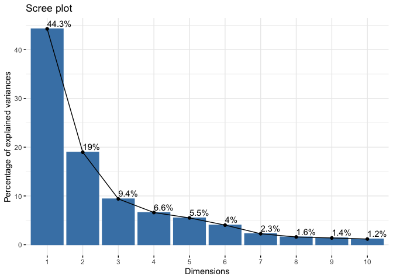

Class 8 Mini Project: Unsupervised Learning Analysis of Human Breast
Cancer Cells
================
Audrey Nguyen

## Data import

We first have to download and import our data correctly into our R
session. We can use the `read.csv()` function to read the CSV
(comma-separated values) file containing the data (avaliable from our
class website).

``` r
# Save your input data file into your Project directory 
fna.data <- "WisconsinCancer.csv"
wisc.df <- read.csv(fna.data, row.names = 1)
```

Examine your input data to ensure column names are set correctly.

``` r
head(wisc.df)
```

             diagnosis radius_mean texture_mean perimeter_mean area_mean
    842302           M       17.99        10.38         122.80    1001.0
    842517           M       20.57        17.77         132.90    1326.0
    84300903         M       19.69        21.25         130.00    1203.0
    84348301         M       11.42        20.38          77.58     386.1
    84358402         M       20.29        14.34         135.10    1297.0
    843786           M       12.45        15.70          82.57     477.1
             smoothness_mean compactness_mean concavity_mean concave.points_mean
    842302           0.11840          0.27760         0.3001             0.14710
    842517           0.08474          0.07864         0.0869             0.07017
    84300903         0.10960          0.15990         0.1974             0.12790
    84348301         0.14250          0.28390         0.2414             0.10520
    84358402         0.10030          0.13280         0.1980             0.10430
    843786           0.12780          0.17000         0.1578             0.08089
             symmetry_mean fractal_dimension_mean radius_se texture_se perimeter_se
    842302          0.2419                0.07871    1.0950     0.9053        8.589
    842517          0.1812                0.05667    0.5435     0.7339        3.398
    84300903        0.2069                0.05999    0.7456     0.7869        4.585
    84348301        0.2597                0.09744    0.4956     1.1560        3.445
    84358402        0.1809                0.05883    0.7572     0.7813        5.438
    843786          0.2087                0.07613    0.3345     0.8902        2.217
             area_se smoothness_se compactness_se concavity_se concave.points_se
    842302    153.40      0.006399        0.04904      0.05373           0.01587
    842517     74.08      0.005225        0.01308      0.01860           0.01340
    84300903   94.03      0.006150        0.04006      0.03832           0.02058
    84348301   27.23      0.009110        0.07458      0.05661           0.01867
    84358402   94.44      0.011490        0.02461      0.05688           0.01885
    843786     27.19      0.007510        0.03345      0.03672           0.01137
             symmetry_se fractal_dimension_se radius_worst texture_worst
    842302       0.03003             0.006193        25.38         17.33
    842517       0.01389             0.003532        24.99         23.41
    84300903     0.02250             0.004571        23.57         25.53
    84348301     0.05963             0.009208        14.91         26.50
    84358402     0.01756             0.005115        22.54         16.67
    843786       0.02165             0.005082        15.47         23.75
             perimeter_worst area_worst smoothness_worst compactness_worst
    842302            184.60     2019.0           0.1622            0.6656
    842517            158.80     1956.0           0.1238            0.1866
    84300903          152.50     1709.0           0.1444            0.4245
    84348301           98.87      567.7           0.2098            0.8663
    84358402          152.20     1575.0           0.1374            0.2050
    843786            103.40      741.6           0.1791            0.5249
             concavity_worst concave.points_worst symmetry_worst
    842302            0.7119               0.2654         0.4601
    842517            0.2416               0.1860         0.2750
    84300903          0.4504               0.2430         0.3613
    84348301          0.6869               0.2575         0.6638
    84358402          0.4000               0.1625         0.2364
    843786            0.5355               0.1741         0.3985
             fractal_dimension_worst
    842302                   0.11890
    842517                   0.08902
    84300903                 0.08758
    84348301                 0.17300
    84358402                 0.07678
    843786                   0.12440

We need to take out the first column `wisc.df$diagnosis` because it has
the “answer”. We don’t want to include this in our analysis. We need to
create a new data.frame that omits this first column.

``` r
# We can use -1 here to remove the first column
wisc.data <- wisc.df[, -1]
```

Setup a new separate vector called `diagnosis` that contains the data
from the diagnosis column of the original dataset. We will store this as
a *factor* (useful for plotting) and use this later to check our
results.

``` r
# Create diagnosis vector for later
diagnosis <- as.factor(wisc.df[, 1])
```

## Exploratory data analysis

> Q1. How many observations are in this dataset?

``` r
nrow(wisc.data)
```

    [1] 569

There are 569 observations in this dataset.

> Q2. How many of the observations have a malignant diagnosis?

``` r
table(wisc.df$diagnosis)
```


      B   M 
    357 212 

> Q3. How many variables/features in the data are suffixed with `_mean`?

First find the column names.

``` r
colnames(wisc.data)
```

     [1] "radius_mean"             "texture_mean"           
     [3] "perimeter_mean"          "area_mean"              
     [5] "smoothness_mean"         "compactness_mean"       
     [7] "concavity_mean"          "concave.points_mean"    
     [9] "symmetry_mean"           "fractal_dimension_mean" 
    [11] "radius_se"               "texture_se"             
    [13] "perimeter_se"            "area_se"                
    [15] "smoothness_se"           "compactness_se"         
    [17] "concavity_se"            "concave.points_se"      
    [19] "symmetry_se"             "fractal_dimension_se"   
    [21] "radius_worst"            "texture_worst"          
    [23] "perimeter_worst"         "area_worst"             
    [25] "smoothness_worst"        "compactness_worst"      
    [27] "concavity_worst"         "concave.points_worst"   
    [29] "symmetry_worst"          "fractal_dimension_worst"

Next I need to search within the column names for “\_mean” pattern. The
`grep()` function might help us.

``` r
inds <- grep("_mean", colnames(wisc.data))
length(inds)
```

    [1] 10

> Q. How many dimensions are in this dataset?

``` r
ncol(wisc.data)
```

    [1] 30

# Principal Component Analysis

## Performing PCA

It’s important to check if the data needs to be scaled before performing
PCA, because the input variables might use different units of
measurement or have significantly different variances.

``` r
# Check column means and standard devations
colMeans(wisc.data)
```

                radius_mean            texture_mean          perimeter_mean 
               1.412729e+01            1.928965e+01            9.196903e+01 
                  area_mean         smoothness_mean        compactness_mean 
               6.548891e+02            9.636028e-02            1.043410e-01 
             concavity_mean     concave.points_mean           symmetry_mean 
               8.879932e-02            4.891915e-02            1.811619e-01 
     fractal_dimension_mean               radius_se              texture_se 
               6.279761e-02            4.051721e-01            1.216853e+00 
               perimeter_se                 area_se           smoothness_se 
               2.866059e+00            4.033708e+01            7.040979e-03 
             compactness_se            concavity_se       concave.points_se 
               2.547814e-02            3.189372e-02            1.179614e-02 
                symmetry_se    fractal_dimension_se            radius_worst 
               2.054230e-02            3.794904e-03            1.626919e+01 
              texture_worst         perimeter_worst              area_worst 
               2.567722e+01            1.072612e+02            8.805831e+02 
           smoothness_worst       compactness_worst         concavity_worst 
               1.323686e-01            2.542650e-01            2.721885e-01 
       concave.points_worst          symmetry_worst fractal_dimension_worst 
               1.146062e-01            2.900756e-01            8.394582e-02 

``` r
round(apply(wisc.data, 2, sd), 3)
```

                radius_mean            texture_mean          perimeter_mean 
                      3.524                   4.301                  24.299 
                  area_mean         smoothness_mean        compactness_mean 
                    351.914                   0.014                   0.053 
             concavity_mean     concave.points_mean           symmetry_mean 
                      0.080                   0.039                   0.027 
     fractal_dimension_mean               radius_se              texture_se 
                      0.007                   0.277                   0.552 
               perimeter_se                 area_se           smoothness_se 
                      2.022                  45.491                   0.003 
             compactness_se            concavity_se       concave.points_se 
                      0.018                   0.030                   0.006 
                symmetry_se    fractal_dimension_se            radius_worst 
                      0.008                   0.003                   4.833 
              texture_worst         perimeter_worst              area_worst 
                      6.146                  33.603                 569.357 
           smoothness_worst       compactness_worst         concavity_worst 
                      0.023                   0.157                   0.209 
       concave.points_worst          symmetry_worst fractal_dimension_worst 
                      0.066                   0.062                   0.018 

Execute PCA with the `prcomp()` function on the `wisc.data`, scaling if
appropriate, and assign the output model to `wisc.pr`. It also looks
like we need to scale the data.

``` r
wisc.pr <- prcomp(wisc.data, scale = TRUE)
```

``` r
# Look at summary of results
summary(wisc.pr)
```

    Importance of components:
                              PC1    PC2     PC3     PC4     PC5     PC6     PC7
    Standard deviation     3.6444 2.3857 1.67867 1.40735 1.28403 1.09880 0.82172
    Proportion of Variance 0.4427 0.1897 0.09393 0.06602 0.05496 0.04025 0.02251
    Cumulative Proportion  0.4427 0.6324 0.72636 0.79239 0.84734 0.88759 0.91010
                               PC8    PC9    PC10   PC11    PC12    PC13    PC14
    Standard deviation     0.69037 0.6457 0.59219 0.5421 0.51104 0.49128 0.39624
    Proportion of Variance 0.01589 0.0139 0.01169 0.0098 0.00871 0.00805 0.00523
    Cumulative Proportion  0.92598 0.9399 0.95157 0.9614 0.97007 0.97812 0.98335
                              PC15    PC16    PC17    PC18    PC19    PC20   PC21
    Standard deviation     0.30681 0.28260 0.24372 0.22939 0.22244 0.17652 0.1731
    Proportion of Variance 0.00314 0.00266 0.00198 0.00175 0.00165 0.00104 0.0010
    Cumulative Proportion  0.98649 0.98915 0.99113 0.99288 0.99453 0.99557 0.9966
                              PC22    PC23   PC24    PC25    PC26    PC27    PC28
    Standard deviation     0.16565 0.15602 0.1344 0.12442 0.09043 0.08307 0.03987
    Proportion of Variance 0.00091 0.00081 0.0006 0.00052 0.00027 0.00023 0.00005
    Cumulative Proportion  0.99749 0.99830 0.9989 0.99942 0.99969 0.99992 0.99997
                              PC29    PC30
    Standard deviation     0.02736 0.01153
    Proportion of Variance 0.00002 0.00000
    Cumulative Proportion  1.00000 1.00000

> Q4. From your results, what proportion of the original variance is
> captures by the first principal components (PC1)?

44.27%

> Q5. How many principal components (PCs) are required to describe at
> least 70% of the original variance in the data?

3 PCs capture about 72%.

> Q6. How many principal components (PCs) are required to describe at
> least 90% of the original variance in the data?

7 PCs capture about 91%.

\##Interpreting PCA results

Create a biplot of the `wisc.pr` using the `biplot()` function.

``` r
biplot(wisc.pr)
```


> Q7. What stands out to you about this plot? Is it easy or difficult to
> understand?

All the points seem to originate from one common place. It’s difficult
to understand, because it’s hard to make out the values. Everything is
clustered together.

Let’s generate a more standard scatter plot of each observation along
the principal components.

``` r
# Scatter plot observations by components 1 and 2
plot(wisc.pr$x[, 1], wisc.pr$x[, 2], col = diagnosis, 
     xlab = "PC1", ylab = "PC2")
```


> Q3. Generate a similar plot for principal components 1 and 3. What do
> you notice about these plots?

``` r
# Repeat for components 1 and 3
plot(wisc.pr$x[, 1], wisc.pr$x[, 3], col = diagnosis, 
     xlab = "PC1", ylab = "PC3")
```


There are less overlapping values in the PC1/PC2 plot, compared to the
PC1/PC3 plot.

Let’s see if we can use the **ggplot2** package to make a more fancy
figure of these results. Remember that ggplot requires a data.frame as
input and we will also need to add our `diagnosis` vector as a column if
we want to use it for mapping to the plot color aesthetic.

``` r
# Create a data.frame for ggplot
df <- as.data.frame(wisc.pr$x)
df$diagnosis <- diagnosis

# Load the ggplot2 package
library(ggplot2)

# Make a scatter plot colored by diagnosis
ggplot(df) + 
  aes(PC1, PC2, col=diagnosis) + 
  geom_point()
```


## Variance explained

Calculate the variance of each principal component by squaring the sdev
component of `wisc.pr` (i.e. `wisc.pr$sdev^2`). Save the result as an
object called `pr.var`.

``` r
# Calculate the variance of each component
pr.var <- wisc.pr$sdev^2
head(pr.var)
```

    [1] 13.281608  5.691355  2.817949  1.980640  1.648731  1.207357

Calculate the variance explained by each principal component by dividing
by the total variance explained of all principal components. Assign this
to a variable called `pve` and create a plot of variance explained for
each principal component.

``` r
# Variance explained by each principal component: pve
pve <- pr.var / sum(pr.var)

# Plot variance explained for each principal component
plot(pve, xlab = "Principal Component", 
     ylab = "Proportion of Variance Explained", 
     ylim = c(0, 1), type = "o")
```


``` r
# Alternative scree plot of the same data, note data driven y-axis
barplot(pve, ylab = "Precent of Variance Explained",
     names.arg=paste0("PC",1:length(pve)), las=2, axes = FALSE)
axis(2, at=pve, labels=round(pve,2)*100 )
```


OPTIONAL: There are quite a few CRAN packages that are helpful for PCA.
This includes the **factoextra** package. Feel free to explore this
package. For example:

``` r
## ggplot based graph
#install.packages("factoextra")
library(factoextra)
```

    Welcome! Want to learn more? See two factoextra-related books at https://goo.gl/ve3WBa

``` r
fviz_eig(wisc.pr, addlabels = TRUE)
```



## Communicating PCA results

> Q9. For the first principal component, what is the component of the
> loading vector (i.e. `wisc.pr$rotation[,1]`) for the feature
> `concave.points_mean`?

How much do the original variables contribute to the new PCs that we
have calculated? Look at the `$rotation` component of the returned PCA
object.

``` r
wisc.pr$rotation["concave.points_mean", 1]
```

    [1] -0.2608538

There is a complicated mix of variables that make up PC1.

``` r
loadings <- as.data.frame(wisc.pr$rotation)
ggplot(loadings) + 
  aes(PC1, rownames(loadings)) +
  geom_col()
```


> Q10. What is the minimum number of principal components required to
> explain 80% of the variance of the data?

You need 5 principal components to explain 80% of the variance in the
data.

# Hierarchical clustering

``` r
# Scale the wisc.data data using the "scale()" function
data.scaled <- scale(wisc.data)
```

Calculate the (Euclidean) distances between all pairs of observations in
the new scaled data set and assign the result to `data.dist`.

``` r
data.dist <- dist(data.scaled)
```

Calculate a hierarchical clustering model using complete linkage.
Manually specify the method argument to `hclust()` and assign the
results to `wisc.hclust`.

``` r
wisc.hclust <- hclust(data.dist, method = "complete", members = NULL)
```

## Results of hierarchical clustering

> Q11. Using the `plot()` and `abline()` functions, what is the height
> at which the clustering model has 4 clusters?

``` r
plot(wisc.hclust)
abline(h = 19, col="red", lty = 2)
```


## Selecting number of clusters

``` r
wisc.hclust.clusters <- cutree(wisc.hclust, k = 2)
```

``` r
table(wisc.hclust.clusters, diagnosis)
```

                        diagnosis
    wisc.hclust.clusters   B   M
                       1 357 210
                       2   0   2

Changing the k value doesn’t really have an effect on the accuracy
matches.

I like the `ward.D2` method, because you can quantify the values between
the clusters and diagnosis.

``` r
d <- dist(wisc.pr$x[, 1:3])
wisc.pr.hclust <- hclust(d, method = "ward.D2")
```

``` r
plot(wisc.pr.hclust)
```


``` r
grps <- cutree(wisc.pr.hclust, k = 2)
table(grps)
```

    grps
      1   2 
    203 366 

``` r
table(grps, diagnosis)
```

        diagnosis
    grps   B   M
       1  24 179
       2 333  33

``` r
plot(wisc.pr$x[, 1:2], col = grps)
```


``` r
plot(wisc.pr$x[, 1:2], col = diagnosis)
```


``` r
wisc.pr.hclust.clusters <- cutree(wisc.pr.hclust, k = 2)
```

``` r
table(wisc.pr.hclust.clusters, diagnosis)
```

                           diagnosis
    wisc.pr.hclust.clusters   B   M
                          1  24 179
                          2 333  33

``` r
(179 + 333)/569
```

    [1] 0.8998243

The cluster model is about 90% accurate.
