Class 18: Mutational Signatures in Cancer
================
Audrey Nguyen

# Exploring a cancer sequencing data portal

> Q. How many cancer samples are included in the dataset?

There are 448 cancer samples.

> Q. Which is the most mutated gene?

TTN is the most mutated gene.

> Q. Which is the most common treatment undergone by patients?

Radiation 1 is the most common treatment.

# Generating mutational matrices and visualizing mutational profiles

We just got the matrices directly, since the packages took a long time
to download.

``` r
mm_scm = read.delim('http://www.tinyurl.com/skinmatrix')

# Install MutationalPatterns package
if (!require("MutationalPatterns")){
BiocManager::install("MutationalPatterns")
}
```

    Loading required package: MutationalPatterns

    Warning: package 'MutationalPatterns' was built under R version 4.2.2

    Loading required package: GenomicRanges

    Warning: package 'GenomicRanges' was built under R version 4.2.2

    Loading required package: stats4

    Loading required package: BiocGenerics

    Warning: package 'BiocGenerics' was built under R version 4.2.1


    Attaching package: 'BiocGenerics'

    The following objects are masked from 'package:stats':

        IQR, mad, sd, var, xtabs

    The following objects are masked from 'package:base':

        anyDuplicated, aperm, append, as.data.frame, basename, cbind,
        colnames, dirname, do.call, duplicated, eval, evalq, Filter, Find,
        get, grep, grepl, intersect, is.unsorted, lapply, Map, mapply,
        match, mget, order, paste, pmax, pmax.int, pmin, pmin.int,
        Position, rank, rbind, Reduce, rownames, sapply, setdiff, sort,
        table, tapply, union, unique, unsplit, which.max, which.min

    Loading required package: S4Vectors

    Warning: package 'S4Vectors' was built under R version 4.2.2


    Attaching package: 'S4Vectors'

    The following objects are masked from 'package:base':

        expand.grid, I, unname

    Loading required package: IRanges

    Warning: package 'IRanges' was built under R version 4.2.1

    Loading required package: GenomeInfoDb

    Warning: package 'GenomeInfoDb' was built under R version 4.2.2

    Loading required package: NMF

    Loading required package: registry

    Loading required package: rngtools

    Loading required package: cluster

    NMF - BioConductor layer [OK] | Shared memory capabilities [NO: bigmemory] | Cores 15/16

      To enable shared memory capabilities, try: install.extras('
    NMF
    ')


    Attaching package: 'NMF'

    The following object is masked from 'package:S4Vectors':

        nrun

``` r
# Generate mutational profiles (4 random samples)
library(MutationalPatterns)
set.seed(11111) # fixing the seed for random number generation

samples_to_plot = sample(1:ncol(mm_scm),4) # selecting 4 random samples
plot_96_profile(mm_scm[,samples_to_plot], condensed = T)
```

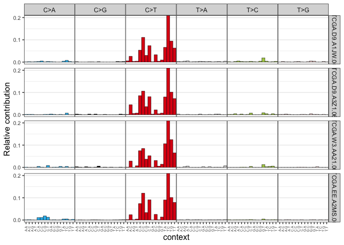

``` r
# Generate mutational profiles (top 4 mutated samples and top 4 less mutated)
mutations_in_samples = colSums(mm_scm)
mutations_in_samples = sort(mutations_in_samples, decreasing = T)
samples_to_plot = names(mutations_in_samples)[1:4]
plot_96_profile(mm_scm[,samples_to_plot], condensed = T)
```

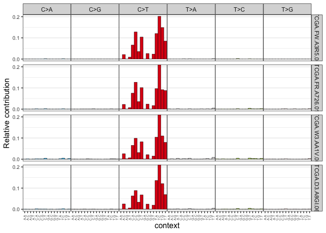

``` r
mutations_in_samples = sort(mutations_in_samples, decreasing = F)
samples_to_plot = names(mutations_in_samples)[1:4]
plot_96_profile(mm_scm[,samples_to_plot], condensed = T)
```

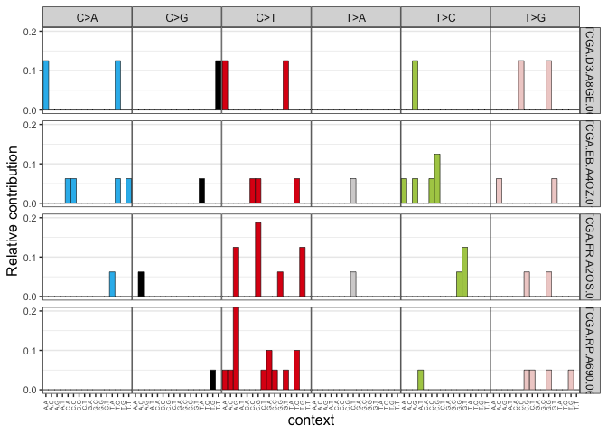

``` r
# Generate average mutational profiles
relative_mutational_profile = apply(mm_scm, 2, prop.table) # obtained relative
                                                            # mutational matrix
average_mutational_profile = rowMeans(relative_mutational_profile)
average_mutational_profile = data.frame(average_mutational_profile)
plot_96_profile(average_mutational_profile, condensed = T)
```

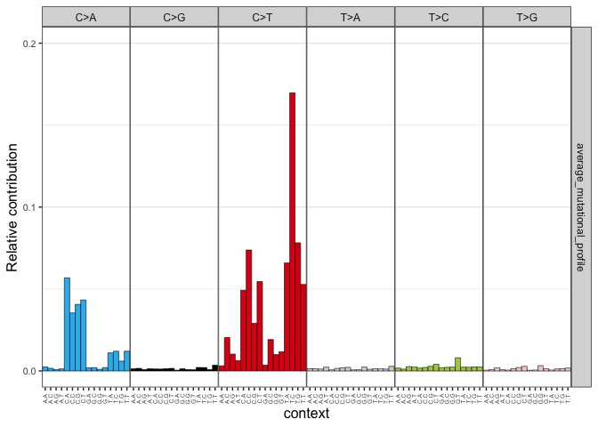

# Assigning reference mutational signatures

``` r
# Mutational signature assignment
cosmic_signatures = get_known_signatures(source = 'COSMIC_v3.2')
fit_res = fit_to_signatures(mm_scm, cosmic_signatures)

# Top contributing signatures
contributions = fit_res$contribution

top_contributing_signatures_abs = rowMeans(contributions)
top_contributing_signatures_abs = sort(top_contributing_signatures_abs,
                                       decreasing = T)[1:4]

## Top 4 contributing signatures (absolute values)
top_contributing_signatures_abs
```

        SBS7a     SBS7b     SBS38      SBS4 
    366.97614 340.91011 204.44450  99.49106 

``` r
relative_contributions = apply(contributions,2,prop.table)
top_contributing_signatures_rel = rowMeans(relative_contributions)
top_contributing_signatures_rel = sort(top_contributing_signatures_rel,
                                       decreasing = T)[1:4]

## Top 4 contributing signatures (relative values)
top_contributing_signatures_rel 
```

         SBS7b      SBS7a      SBS38       SBS4 
    0.26336351 0.26019455 0.10885595 0.07240978 

``` r
# Mutational signature assignment strict
fit_res_strict = fit_to_signatures_strict(mm_scm, cosmic_signatures)
fit_res_strict = fit_res_strict$fit_res
contributions_strict = fit_res_strict$contribution 
```

# Visualizing mutational signature assignment results

``` r
# Visualization of signature assignment results (fit_to_signatures)
set.seed(11111)
samples_to_plot = sample(1:ncol(mm_scm),4)

plot_contribution(contributions[,samples_to_plot], mode = "absolute")
```

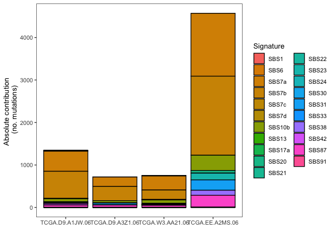

``` r
plot_contribution(contributions[,samples_to_plot], mode = "relative")
```


``` r
plot_contribution_heatmap(contributions, cluster_samples = F)
```

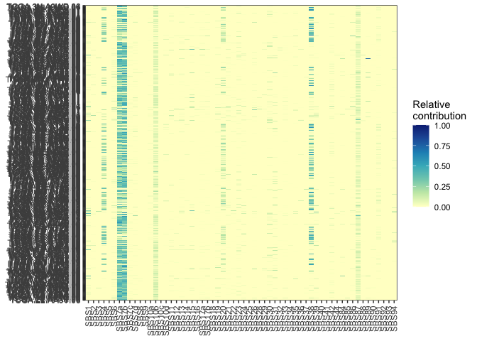

``` r
# Visualization of signature assignment results (strict)
plot_contribution(contributions_strict[,samples_to_plot], mode = "absolute") 
```

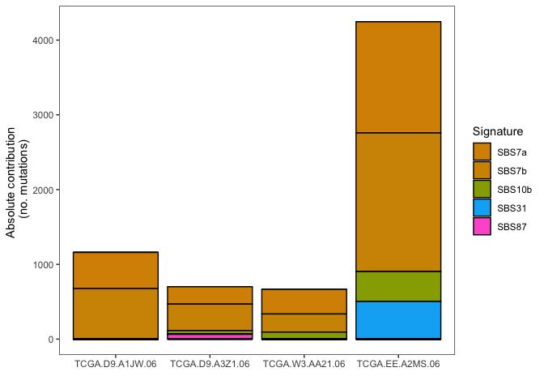

``` r
plot_contribution(contributions_strict[,samples_to_plot], mode = "relative")
```

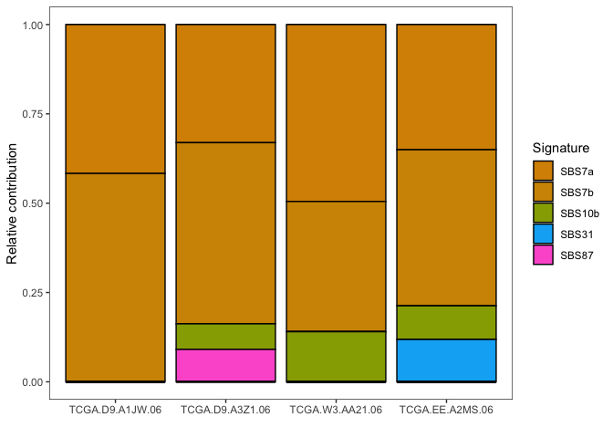

``` r
plot_contribution_heatmap(contributions_strict, cluster_samples = F)
```

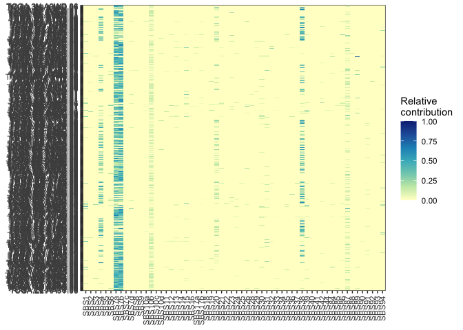

``` r
# Cosine similarity reconstruction vs. original mutational profile (fit_to_signatures)
set.seed(11111)
samples_to_plot = sample(1:ncol(mm_scm),4)

plot_original_vs_reconstructed(mm_scm[,samples_to_plot],
                               fit_res$reconstructed[,samples_to_plot], 
                               y_intercept = 0.90) 
```

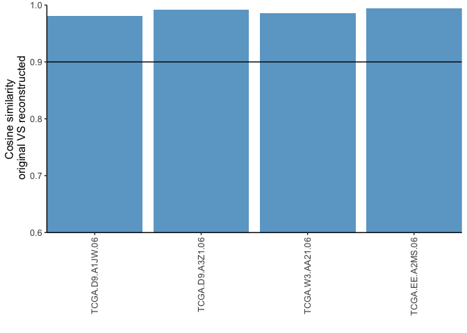

``` r
# Cosine similarity reconstruction vs. original mutational profile (strict)
plot_original_vs_reconstructed(mm_scm[,samples_to_plot],
                               fit_res_strict$reconstructed[,samples_to_plot], 
                               y_intercept = 0.90)
```

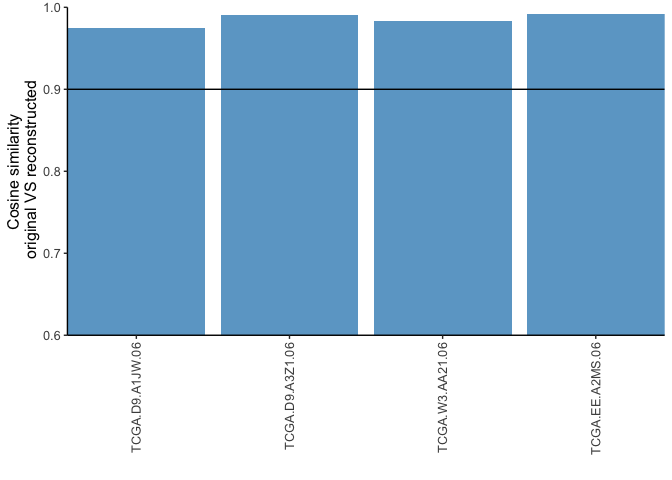

> Q. Which is the etiology of the top absolute contributing signature
> for liver cancer?

Aristolochic acid exposure

> Q. Which is the most prominent mutational context for the top
> contributing signature in skin cancer?

C \> T, because it pops up the most on the average mutational profile.

> Q. The etiology of the top contributing signature for lung cancer
> corresponds to an endogenous cellular mechanism.

FALSE, because it corresponds to an exogenous cellular mechanism.

> Q. SBS4 is one of the most common signatures found in lung cancer and
> is associated with tobacco smoking.

TRUE

> Q. SBS7d is one of the most common signatures in skin cancer and is
> associated with UV light exposure and high numbers of C \> T
> mutations.

FALSE, because SBS7d isn’t on the absolute & relative contributions.
SBS7a and SBS7b are more common, according to the absolute & relative
contributions.
